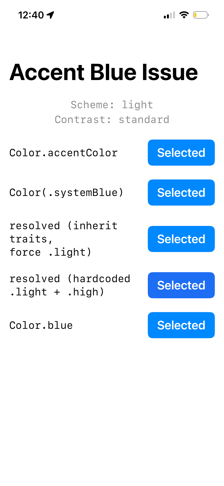
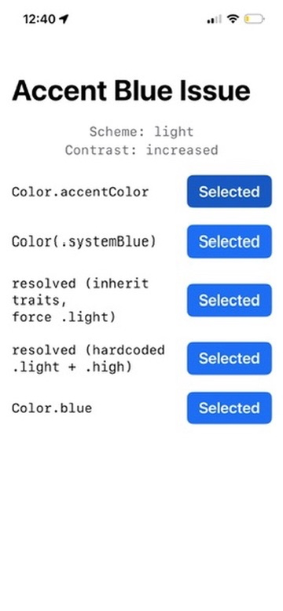
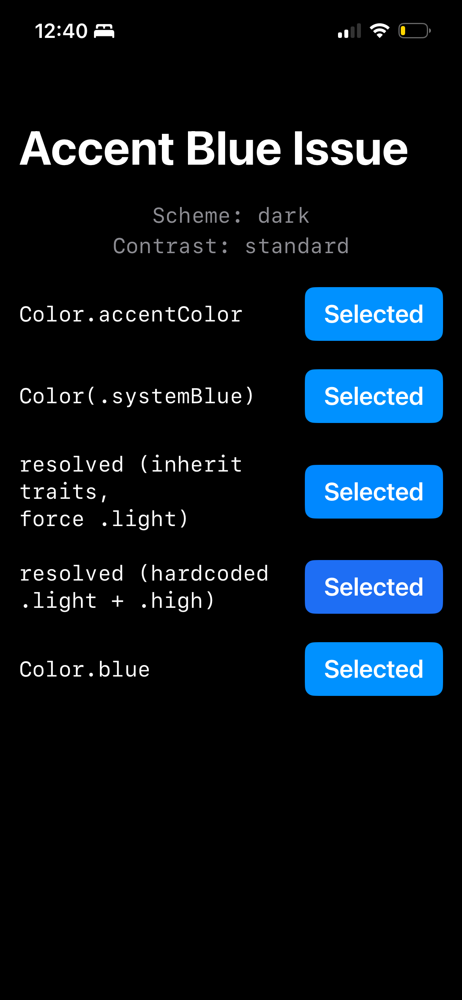
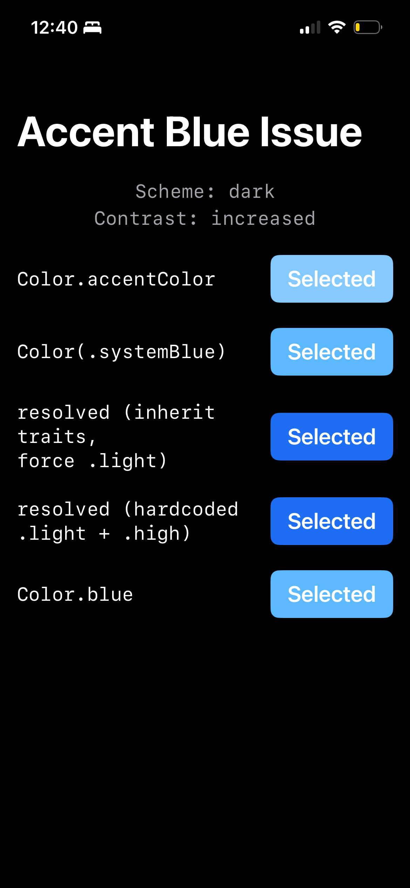

# Accent Blue Contrast Issue

In Dark Mode + "Increase Contrast" (iOS accessibility setting), `Color.accentColor` / `UIColor.systemBlue` resolves to a **lighter, washed-out blue** that reduces readability on filled backgrounds (buttons, chips, toggles).

I expected the high-contrast variant to be **more saturated/darker** (like the light-mode increased-contrast version), but instead it goes lighter.

Attempting to resolve `UIColor.systemBlue` against a light-mode trait collection via `resolvedColor(with:)` does **not** produce the same color the system renders in actual Light Mode + Increase Contrast.

## Screenshots

| Light / Standard | Light / Increased | Dark / Standard | Dark / Increased |
|:---:|:---:|:---:|:---:|
|  |  |  |  |

**Note the dark + increased row:** `Color.accentColor` and `Color(.systemBlue)` both become a pale, low-contrast blue. The `resolvedColor(with:)` attempts (rows 3-4) produce a darker blue, but it doesn't match the actual light-mode increased-contrast blue shown in column 2.

## What I've tried

```swift
// Approach 1: inherit current traits, force light mode
let base = UITraitCollection.current
let light = base.modifyingTraits { $0.userInterfaceStyle = .light }
Color(UIColor.systemBlue.resolvedColor(with: light))

// Approach 2: hardcoded light + high contrast traits
Color(UIColor.systemBlue.resolvedColor(
    with: UITraitCollection { traits in
        traits.userInterfaceStyle = .light
        traits.accessibilityContrast = .high
    }
))
```

Neither produces a color matching what the system actually renders for `Color.accentColor` in Light Mode + Increase Contrast.

## Question

How can I resolve `UIColor.systemBlue` to get the **exact same color** that iOS uses in Light Mode + Increase Contrast, so I can use it as an override in Dark Mode + Increase Contrast?

## Environment

- iOS 18+ (also tested on iOS 26 beta)
- Swift 6, SwiftUI
- Xcode 16.2+

## Reproducing

1. Clone and open `HighContrastBlueDemo.xcodeproj`
2. Run on a device or simulator
3. Toggle Dark Mode and Increase Contrast in Settings > Accessibility > Display & Text Size
4. Compare the five color swatches across all four combinations
